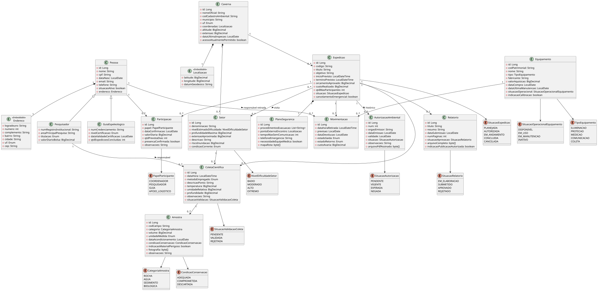

# Furna de Lampião

Sistema para gerenciamento de cavernas, setores, expedições e profissionais envolvidos nas atividades espeleológicas.

## Stack

- Java 11
- JPA 2.2
- Hibernate 5.6
- PostgreSQL 15
- Maven
- Lombok
- Docker / Docker Compose

## Estrutura

```text
.
├── src
│   ├── main
│   │   ├── java/com
│   │   │   └── furnadelampiao
│   │   │        ├── entity
│   │   │        ├── enums
│   │   │        ├── repository
│   │   │        ├── service
│   │            ├── seed
│   │   │        │   
│   │   │        └── Main.java
│   │   └── resources
│   │       └── META-INF
│   │           └── persistence.xml
│   └── test
├── docker-compose.yml
├── pom.xml
└── README.md
```
## Diagrama de classes


## Seed
```bash
mvn compile exec:java "-Dexec.mainClass=com.furnadelampiao.seed.SeedRunner"
```

## Docker
desenvolvimento
```bash
docker compose up -d
```
```bash
docker compose down -v
```


