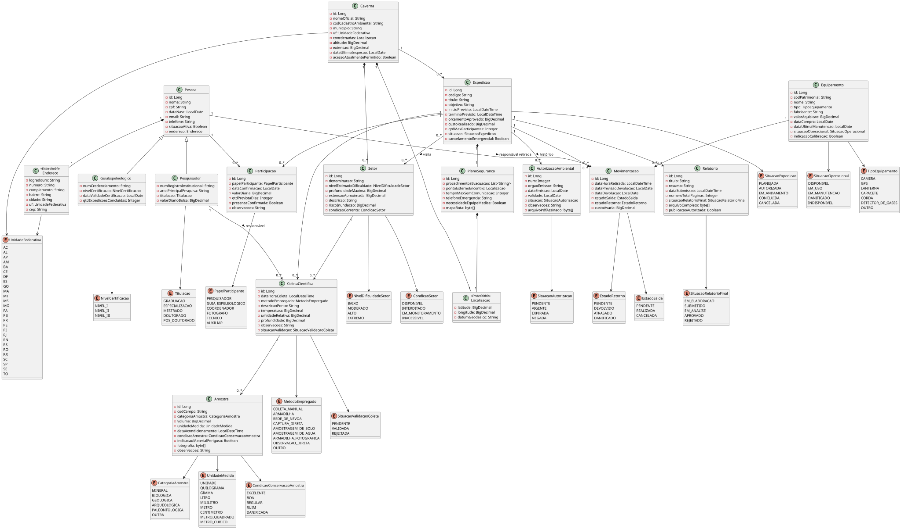

# Furna de Lampião

## Modelagem e Decisões de Persistência

**Disciplina:** Programação para a Web 3  
**Instituição:** IFPB  
**Projeto:** TurmalinaPB  
**Tecnologias:** Java 11, JPA 2.2, Hibernate 5.6, PostgreSQL 15

---

## 1. Introdução

Este documento apresenta as decisões de modelagem e de persistência do sistema **Furna de Lampião**, desenvolvido para o Projeto TurmalinaPB (sistema de expedições científicas subterrâneas).

O modelo foi construído com JPA/Hibernate e PostgreSQL e cobre pessoas, cavernas, setores, expedições, planos de segurança, autorizações ambientais, participações, equipamentos, movimentações, coletas, amostras e relatório final.

O documento registra e justifica as decisões sobre herança, objetos incorporáveis, associações, ownership, cascatas, `orphanRemoval`, tipos de dados, estratégia de carregamento e consultas.

---

## 2. Diagrama de Classes

O diagrama de classes elaborado antes da implementação está em `docs/system-class-diagram.wsd` (fonte PlantUML) e `docs/SystemClassDiagram.svg`.



O modelo possui **14 entidades**:

| Grupo | Entidades |
|---|---|
| Pessoas | `Pessoa`, `Pesquisador`, `GuiaEspeleologico` |
| Local | `Caverna`, `Setor` |
| Expedição | `Expedicao`, `PlanoSeguranca`, `AutorizacaoAmbiental`, `Relatorio` |
| Associativas | `Participacao`, `Movimentacao` |
| Recursos e resultados | `Equipamento`, `ColetaCientifica`, `Amostra` |

Há ainda dois tipos incorporáveis (`Endereco` e `Localizacao`) e as enumerações do domínio.

---

## 3. Modelo de Objetos

### 3.1 Pessoa e especializações

`Pessoa` concentra os dados comuns (nome, CPF, data de nascimento, e-mail, telefone, situação ativa e endereço). `Pesquisador` e `GuiaEspeleologico` acrescentam os atributos específicos de cada papel.

`Pessoa` foi mantida como **classe concreta**. O enunciado apresenta pesquisador e guia como tipos de pessoa, mas não exige que toda pessoa cadastrada pertença a uma especialização, e ainda prevê novos tipos no futuro. Uma pessoa sem especialização (por exemplo, um técnico de apoio) continua sendo cadastrável.

### 3.2 Participação

A relação entre pessoa e expedição é muitos-para-muitos com atributos próprios, por isso foi modelada como a entidade associativa `Participacao`, com identidade própria e os atributos:

- papel desempenhado (`PapelParticipante`);
- data de confirmação;
- valor da diária;
- quantidade prevista de dias;
- presença confirmada;
- observações.

A regra de que a mesma pessoa não pode ser cadastrada duas vezes na mesma expedição é garantida no banco por `UNIQUE (pessoa_id, expedicao_id)`.

`Expedicao` **não** mantém uma coleção de `Participacao`. A associação é navegada a partir de `Participacao`, o que impede que consultar uma expedição arraste participantes, endereços e especializações (requisito da seção 5 do enunciado).

### 3.3 Caverna e setor

Uma `Caverna` possui vários `Setor`, e cada setor pertence a uma única caverna (`Setor.caverna`, obrigatória).

A expedição se relaciona com uma caverna (`@ManyToOne`) e com os setores visitados (`@ManyToMany`, tabela `tb_expedicao_setor`). A regra de que os setores da expedição pertencem à caverna da própria expedição é validada em `ExpedicaoService.associarSetor`.

### 3.4 Expedição

`Expedicao` representa a atividade de campo: código único, título, objetivo, início e término previstos, orçamento aprovado, custo realizado, quantidade máxima de participantes, situação (`SituacaoExpedicao`) e indicação de cancelamento emergencial.

Cada expedição ocorre em uma caverna e possui exatamente um plano de segurança.

### 3.5 Plano de segurança

O plano é criado exclusivamente para uma expedição. Os procedimentos de evacuação são uma lista ordenada de textos (`@ElementCollection` com `@OrderColumn`), o ponto externo de encontro é um `Localizacao` incorporado, e o mapa de rota é um binário (`@Lob`).

### 3.6 Autorização ambiental

A autorização é uma entidade própria, pois possui atributos e o PDF assinado. Ela pertence a uma única expedição (FK obrigatória) e a expedição pode ter várias autorizações ao longo do histórico. A regra "no máximo uma autorização **vigente**" é aplicada no serviço, pela consulta `AutorizacaoAmbiental.contarVigentesPorExpedicao`, e não por restrição do banco.

### 3.7 Equipamentos e movimentações

`Equipamento` é patrimoniado individualmente (código patrimonial único). Cada utilização é uma `Movimentacao`, ligada à expedição, ao equipamento e à pessoa que retirou, com data e hora de retirada, previsão e data efetiva de devolução, estado na saída, estado no retorno e custo de avaria.

`Equipamento` não possui coleção de movimentações, de modo que consultar um equipamento não carrega seu histórico de utilizações.

### 3.8 Coletas e amostras

`ColetaCientifica` pertence a uma expedição, ocorre em um setor e é conduzida por um `Pesquisador`. Uma coleta gera várias `Amostra`.

O enunciado fala em "massa ou volume". A amostra possui um único valor numérico (`volume`, `NUMERIC(10,2)`) acompanhado de `UnidadeMedida` (g, kg, mL, L etc.), que indica se o valor representa massa ou volume.

### 3.9 Relatório final

Cada expedição pode ter no máximo um `Relatorio`. A associação é `one-to-one`, com a FK `expedicao_id` do relatório declarada `UNIQUE`. O arquivo completo é um binário (`@Lob`).

---

## 4. Estratégia de Herança: `JOINED`

A hierarquia `Pessoa → Pesquisador / GuiaEspeleologico` usa `InheritanceType.JOINED`: os dados comuns ficam em `tb_pessoa` e os específicos em `tb_pesquisador` e `tb_guia_espeleologico`, ligados pela chave primária.

**Justificativa, pelos três critérios do enunciado:**

- **Domínio:** os subtipos têm conjuntos de atributos bem diferentes e o enunciado prevê novos tipos no futuro. Com `JOINED`, um novo tipo de pessoa é apenas uma nova tabela e uma nova subclasse, sem alterar as existentes.
- **Integridade dos dados:** atributos obrigatórios e únicos dos subtipos (`num_registro_institucional`, `num_credenciamento`, titulação, nível de certificação, validade) continuam `NOT NULL` e `UNIQUE` no banco.
- **Consultas esperadas:** `Participacao` e `Movimentacao` referenciam `Pessoa` (qualquer tipo) e `ColetaCientifica` referencia `Pesquisador`, todas com FK simples. Consultas específicas por tipo consultam apenas a tabela do subtipo, e as consultas polimórficas fazem joins simples pela PK.

**Estratégias descartadas:**

| Estratégia | Motivo do descarte |
|---|---|
| `SINGLE_TABLE` | Uma tabela única com todas as colunas dos subtipos exigiria torná-las nullable, perdendo `NOT NULL`/`UNIQUE` no banco, e cresceria a cada novo tipo. |
| `TABLE_PER_CLASS` | Consultas polimórficas exigem `UNION` entre tabelas, e a estratégia é incompatível com identificadores `IDENTITY`, usados em todas as entidades do projeto. |

O custo aceito é o join entre `tb_pessoa` e a tabela do subtipo ao carregar um `Pesquisador` ou `Guia`.

---

## 5. Objetos Incorporáveis

### 5.1 `Endereco`

Composto por logradouro, número, complemento, bairro, cidade, UF (`UnidadeFederativa`) e CEP. Não tem identidade nem tabela própria, e suas colunas são persistidas em `tb_pessoa`, como exige o enunciado.

### 5.2 `Localizacao`

Composto por latitude, longitude e datum geodésico (`NUMERIC(9,6)`, `NUMERIC(9,6)` e texto). É reutilizado em dois lugares:

- `Caverna.coordenadas`: colunas em `tb_caverna`;
- `PlanoSeguranca.pontoExternoEncontro`: colunas em `tb_plano_seguranca`.

Por serem tabelas diferentes, não há conflito de nomes de colunas. Um mesmo tipo de valor é reaproveitado sem criar identidade ou tabela para ele.

---

## 6. Associações, Ownership, Cascatas e `orphanRemoval`

### 6.1 Visão geral

| Associação | Tipo | Lado proprietário (FK) | Cascade | `orphanRemoval` | Fetch |
|---|---|---|---|---|---|
| `Pessoa` → `Endereco` | embutida | — | — | — | — |
| `Caverna` → `Setor` | 1:N bidirecional | `Setor.caverna` | `ALL` | sim | `LAZY` |
| `Expedicao` → `Caverna` | N:1 | `Expedicao.caverna` | não | não | `LAZY` |
| `Expedicao` ↔ `PlanoSeguranca` | 1:1 bidirecional | `Expedicao.planoSeguranca` (`UNIQUE`) | não | não | `LAZY` |
| `Expedicao` ↔ `Relatorio` | 1:1 bidirecional | `Relatorio.expedicao` (`UNIQUE`) | não | não | `LAZY` |
| `Expedicao` → `AutorizacaoAmbiental` | 1:N bidirecional | `AutorizacaoAmbiental.expedicao` | não | não | `LAZY` |
| `Expedicao` ↔ `Setor` | N:N | `Expedicao` (`tb_expedicao_setor`) | não | não | `LAZY` |
| `Participacao` → `Pessoa` / `Expedicao` | N:1 | `Participacao` | não | não | `LAZY` |
| `Movimentacao` → `Expedicao` / `Equipamento` / `Pessoa` | N:1 | `Movimentacao` | não | não | `LAZY` |
| `ColetaCientifica` → `Expedicao` / `Setor` / `Pesquisador` | N:1 | `ColetaCientifica` | não | não | `LAZY` |
| `ColetaCientifica` → `Amostra` | 1:N bidirecional | `Amostra.coletaCientifica` | não | não | `LAZY` |

Em todas as associações bidirecionais o lado inverso usa `mappedBy`, e a FK fica sempre na tabela do lado proprietário.

### 6.2 Cascata e `orphanRemoval`

Somente `Caverna → Setor` usa `CascadeType.ALL` com `orphanRemoval = true`. Um setor é uma parte da caverna: não existe sem ela e não pode pertencer a outra. Remover um setor da coleção (`removerSetor`) o exclui do banco, e remover a caverna remove seus setores. Os métodos `adicionarSetor` e `removerSetor` mantêm os dois lados da associação sincronizados.

Nas demais associações os objetos têm **ciclo de vida próprio**: pessoas, equipamentos e cavernas continuam existindo quando uma expedição é removida, e `Participacao`, `Movimentacao` e `Coleta` são registros históricos. Cascata ou `orphanRemoval` nessas relações poderiam apagar dados que não deveriam ser afetados.

### 6.3 Expedição e plano de segurança

`Expedicao` é o lado proprietário: a coluna `plano_seguranca_id` é `NOT NULL` e `UNIQUE`, o que garante no banco que cada plano pertence a uma única expedição e que toda expedição tem plano. A associação é navegável nos dois sentidos (`PlanoSeguranca.expedicao` é o lado inverso).

Como a chave estrangeira fica em `Expedicao` e é obrigatória, o plano de segurança precisa existir **antes** da expedição: uma expedição só pode ser cadastrada já vinculada a um plano. Isso reflete a regra de domínio de que uma expedição não deve ser planejada sem que seus procedimentos de segurança estejam definidos. O plano é persistido pelo `PlanoSegurancaService`, e o `ExpedicaoService` valida que ele já existe antes de cadastrar a expedição.

Não foi aplicada cascata nessa associação: o vínculo exclusivo (um plano para cada expedição) é garantido pela FK `NOT NULL` + `UNIQUE`, e não pela propagação de operações.

A alternativa seria `cascade = ALL` com `orphanRemoval = true` em `Expedicao.planoSeguranca`, fazendo o plano nascer e morrer junto com a expedição. Ela aproximaria o ciclo de vida descrito no enunciado, ao custo de acoplar a persistência do plano à da expedição.

### 6.4 Autorização ambiental

A FK fica em `tb_autorizacao_ambiental.expedicao_id`. O modelo admite várias autorizações por expedição (histórico: pendente, vigente, expirada, negada), e a regra de unicidade da autorização vigente é validada no serviço.

---

## 7. Tipos e Restrições

### 7.1 Regras gerais

| Requisito | Solução |
|---|---|
| Identificadores | `Long` com `GenerationType.IDENTITY` (coluna identity/serial do PostgreSQL) |
| Obrigatoriedade | `nullable = false` nos campos essenciais e `optional = false` nas associações obrigatórias |
| Tamanhos | `length` em nomes, códigos, CPF (11), e-mail, telefone, títulos e descrições |
| Unicidade | CPF, e-mail, código da caverna, código da expedição, código patrimonial, código de campo da amostra, registro institucional e credenciamento |
| Valores monetários e medições | `BigDecimal` com `precision` e `scale` |
| Booleanos | `Boolean`, mapeado para o tipo nativo `boolean` do PostgreSQL, sem conversão |
| Enumerações | `@Enumerated(EnumType.STRING)` |
| Arquivos | `@Lob byte[]`, sem conversão para Base64 |

**Enumerações STRING:** o valor persistido é legível (`EM_ANDAMENTO`) e estável: reordenar ou inserir constantes no enum não corrompe os dados já gravados, o que aconteceria com `ORDINAL`.

**Identidade `IDENTITY`:** é a estratégia diretamente compatível com o PostgreSQL. Seu custo é que o Hibernate não consegue agrupar `INSERT`s em lote, o que não é relevante para o volume esperado.

### 7.2 Datas e horários (`java.time`)

| Uso | Tipo Java | Tipo PostgreSQL |
|---|---|---|
| Data sem horário (nascimento, compra, emissão, validade, devolução) | `LocalDate` | `date` |
| Data com horário (início/término previstos, retirada, coleta, acondicionamento, submissão) | `LocalDateTime` | `timestamp` |

Os eventos com horário foram modelados como `LocalDateTime`, pois o sistema opera no horário local da organização. Caso o sistema passe a registrar eventos em vários fusos horários, o tipo indicado seria `Instant` ou `OffsetDateTime` (`timestamptz`).

### 7.3 Arquivos binários

Os binários (`mapaRota`, `arquivoPdfAssinado`, `fotografia`, `arquivoCompleto`) usam `@Lob byte[]`, que o Hibernate mapeia para *large object* (`oid`) no PostgreSQL. Textos longos (`Amostra.observacoes` e `Relatorio.resumo`) usam `TEXT`, que não é objeto grande.

---

## 8. Estratégia de Carregamento

### 8.1 Associações

Todas as associações foram declaradas explicitamente como `FetchType.LAZY`. Isso é necessário porque `@ManyToOne` e `@OneToOne` são `EAGER` por padrão na JPA. **Nenhuma associação está marcada como `EAGER`.** Os dados relacionados são trazidos apenas por consultas específicas (`JOIN FETCH` ou projeções para DTO), com exatamente o que cada caso precisa.

`Participacao` e `Movimentacao` são navegadas a partir do próprio lado (sem coleção em `Expedicao` ou `Equipamento`), evitando que uma consulta simples arraste o grafo inteiro.

### 8.2 Campos binários

Os campos `@Lob` estão declarados com `@Basic(fetch = FetchType.LAZY)`. Porém, no Hibernate 5, essa configuração só tem efeito real com *bytecode enhancement*, que não está habilitado no projeto. Por isso a garantia de que os arquivos não são carregados vem das **consultas**, e não apenas do mapeamento:

- listagens e detalhes usam **projeções para DTO**, que selecionam apenas colunas específicas, sem carregar entidade nem binário;
- os downloads usam **projeção do próprio campo binário** (`SELECT x.arquivo ...`), em consulta separada, acionada apenas quando o usuário solicita o arquivo.

A única consulta de listagem que traz binário junto é a de amostras (seção 10.4), pois a `fotografia` faz parte da entidade `Amostra`.

### 8.3 `OneToOne` inverso

Nas associações `@OneToOne(mappedBy = ...)` (`Expedicao.relatorio` e `PlanoSeguranca.expedicao`), o Hibernate não consegue criar proxy lazy sem saber se o lado inverso existe, e pode consultá-lo ao carregar a entidade. Por isso a listagem de expedições nunca carrega a entidade `Expedicao`: usa projeção com `SELECT new ...`.

---

## 9. Consultas JPA Solicitadas

### 9.1 Expedições por período e situação

```jpql
SELECT new com.furnadelampiao.dto.ExpedicaoResumoDTO(
    e.codigo, e.titulo, e.caverna.nomeOficial,
    e.inicioPrevisto, e.terminoPrevisto, e.situacao)
FROM Expedicao e
WHERE e.inicioPrevisto <= :fimDoDia
  AND e.terminoPrevisto >= :inicioDoDia
  AND e.situacao = :situacao
ORDER BY e.inicioPrevisto
```

Projeção em `ExpedicaoResumoDTO`: apenas código, título, nome da caverna, datas e situação. Traz uma expedição se o seu intervalo **se sobrepõe** ao período informado. É uma única consulta (o nome da caverna vem por join), sem carregar entidades, participantes nem arquivos.

### 9.2 Detalhes da expedição com participantes

`ExpedicaoRepositoryJpa.buscarDetalhesPorId` executa **duas consultas**, independentemente do número de participantes:

1. dados da expedição e nome da caverna em `ExpedicaoDetalheDTO`;
2. todos os participantes (id, nome, papel, data de confirmação, presença) em `ParticipanteResumoDTO`, a partir de `Participacao`.

Não há endereço, especializações ou binários, e não há N+1.

### 9.3 Coletas com setor e pesquisador

```jpql
SELECT c FROM ColetaCientifica c
JOIN FETCH c.setor
JOIN FETCH c.pesquisador
WHERE c.expedicao.id = :id
ORDER BY c.dataHoraColeta
```

Um único `SELECT` com joins traz as coletas com setor e pesquisador já inicializados. Sem o `JOIN FETCH`, acessar `c.getSetor()` e `c.getPesquisador()` em um laço geraria **até** 1 + 2N consultas (problema N+1). Como as associações são `@ManyToOne`, o `JOIN FETCH` não gera duplicação de linhas.

### 9.4 Amostras de uma coleta

`Amostra.buscarPorColetaCientificaId` é chamada somente quando o usuário abre os detalhes de uma coleta. `ColetaCientifica.amostras` é `LAZY`, e a consulta de listagem de coletas (9.3) não toca nas amostras.

### 9.5 Equipamentos disponíveis em uma faixa de datas

```jpql
SELECT e FROM Equipamento e
WHERE e.situacaoOperacional NOT IN :indisponiveis
  AND NOT EXISTS (
    SELECT 1 FROM Movimentacao m
    WHERE m.equipamento = e
      AND m.dataHoraRetirada <= :fimDoDia
      AND COALESCE(m.dataDevolucao, m.dataPrevisaoDevolucao) >= :inicio)
ORDER BY e.nome
```

- Exclui equipamentos em manutenção, danificados ou indisponíveis.
- Exclui equipamentos com movimentação que se sobrepõe à faixa. O fim do uso é a data efetiva de devolução, ou a previsão se ainda não foi devolvido.
- A verificação é uma subconsulta `NOT EXISTS` executada no banco. O histórico de movimentações **não é trazido para a aplicação**.

### 9.6 Download de arquivos

Cada arquivo é buscado por consulta própria, selecionando **apenas a coluna binária**:

```jpql
SELECT p.mapaRota FROM PlanoSeguranca p WHERE p.id = :id
SELECT a.arquivoPdfAssinado FROM AutorizacaoAmbiental a WHERE a.id = :id
SELECT r.arquivoCompleto FROM Relatorio r WHERE r.id = :id   -- Relatorio.buscarArquivoPorRelatorioId
```

---

## 10. Evidências do SQL Gerado

O `hibernate.show_sql` está habilitado. SQL capturado para cada consulta da seção 9 (a numeração de 10.x acompanha a de 9.x):

### 10.1 Listagem de expedições (consulta 9.1)

```sql
select
    expedicao0_.codigo as col_0_0_,
    expedicao0_.titulo as col_1_0_,
    caverna1_.nome_oficial as col_2_0_,
    expedicao0_.inicio_previsto as col_3_0_,
    expedicao0_.termino_previsto as col_4_0_,
    expedicao0_.situacao as col_5_0_
from
    tb_expedicao expedicao0_ cross
join
    tb_caverna caverna1_
where
    expedicao0_.caverna_id=caverna1_.id
    and expedicao0_.inicio_previsto<=?
    and expedicao0_.termino_previsto>=?
    and expedicao0_.situacao=?
order by
    expedicao0_.inicio_previsto
```

Uma única consulta seleciona apenas as seis colunas do DTO. O nome da caverna vem do join com `tb_caverna` (o Hibernate escreve o join implícito como `cross join ... where`, equivalente a um `inner join`). Nenhuma coluna de arquivo e nenhuma tabela de participantes é tocada.

### 10.2 Detalhes da expedição com participantes (consulta 9.2)

```sql
-- consulta 1: dados da expedição
select
    expedicao0_.id as col_0_0_,
    expedicao0_.codigo as col_1_0_,
    expedicao0_.titulo as col_2_0_,
    expedicao0_.objetivo as col_3_0_,
    caverna1_.nome_oficial as col_4_0_,
    expedicao0_.inicio_previsto as col_5_0_,
    expedicao0_.termino_previsto as col_6_0_,
    expedicao0_.orcamento_aprovado as col_7_0_,
    expedicao0_.custo_realizado as col_8_0_,
    expedicao0_.qtd_max_participantes as col_9_0_,
    expedicao0_.situacao as col_10_0_,
    expedicao0_.cancelamento_emergencial as col_11_0_
from
    tb_expedicao expedicao0_ cross
join
    tb_caverna caverna1_
where
    expedicao0_.caverna_id=caverna1_.id
    and expedicao0_.id=?

-- consulta 2: participantes e papéis
select
    participac0_.pessoa_id as col_0_0_,
    pessoa1_.nome as col_1_0_,
    participac0_.papel_participante as col_2_0_,
    participac0_.data_confirmacao as col_3_0_,
    participac0_.presenca_confirmada as col_4_0_
from
    tb_participacao participac0_ cross
join
    tb_pessoa pessoa1_
where
    participac0_.pessoa_id=pessoa1_.id
    and participac0_.expedicao_id=?
order by
    pessoa1_.nome
```

São exatamente **duas consultas**, qualquer que seja o número de participantes (sem N+1). A consulta dos participantes junta apenas `tb_pessoa`: não toca em `tb_pesquisador`, `tb_guia_espeleologico` nem em colunas de endereço, e nenhuma consulta seleciona colunas de arquivo.

### 10.3 Coletas com setor e pesquisador (consulta 9.3)

```sql
select
    coletacien0_.id as id1_3_0_,
    setor1_.id as id1_15_1_,
    pesquisado2_.id as id1_11_2_,
    coletacien0_.data_hora_coleta as data_hor2_3_0_,
    -- (demais colunas de tb_coleta_cientifica omitidas)
    setor1_.denominacao as denomina3_15_1_,
    -- (demais colunas de tb_setor omitidas)
    pesquisado2_1_.nome as nome12_11_2_,
    -- (colunas de tb_pessoa e tb_pesquisador omitidas)
    pesquisado2_.titulacao as titulaca3_10_2_
from
    tb_coleta_cientifica coletacien0_
inner join
    tb_setor setor1_
        on coletacien0_.setor_id=setor1_.id
inner join
    tb_pesquisador pesquisado2_
        on coletacien0_.pesquisador_id=pesquisado2_.id
inner join
    tb_pessoa pesquisado2_1_
        on pesquisado2_.id=pesquisado2_1_.id
where
    coletacien0_.expedicao_id=?
order by
    coletacien0_.data_hora_coleta
```

Um único `select` com `inner join` traz as coletas com setor e pesquisador já inicializados (o join com `tb_pessoa` existe porque `Pesquisador` usa herança `JOINED`). Ao percorrer as coletas e acessar `getSetor()` e `getPesquisador()`, **nenhum SQL adicional foi gerado**, o que confirma que não há N+1.

### 10.4 Amostras de uma coleta (consulta 9.4)

```sql
select
    amostra0_.id as id1_0_,
    amostra0_.categoria_amostra as categori2_0_,
    amostra0_.cod_campo as cod_camp3_0_,
    amostra0_.coleta_cientifica_id as coleta_11_0_,
    amostra0_.condicao_conservacao as condicao4_0_,
    amostra0_.dt_acondicionamento as dt_acond5_0_,
    amostra0_.fotografia as fotograf6_0_,
    amostra0_.indicacao_material_perigoso as indicaca7_0_,
    amostra0_.observacoes as observac8_0_,
    amostra0_.unidade_medida as unidade_9_0_,
    amostra0_.volume as volume10_0_
from
    tb_amostra amostra0_
where
    amostra0_.coleta_cientifica_id=?
```

Executada somente quando o usuário abre os detalhes da coleta. Como a listagem de coletas (10.3) não seleciona amostras, elas não são carregadas antes disso. Esta consulta carrega a entidade `Amostra` completa e, portanto, **inclui a coluna `fotografia`**, porque `@Basic(fetch = LAZY)` não tem efeito sem *bytecode enhancement* (ver seção 8.2).

### 10.5 Equipamentos disponíveis (consulta 9.5)

```sql
select
    equipament0_.id as id1_4_,
    equipament0_.cod_patrimonial as cod_patr2_4_,
    equipament0_.data_compra as data_com3_4_,
    equipament0_.data_ultima_manutencao as data_ult4_4_,
    equipament0_.fabricante as fabrican5_4_,
    equipament0_.indicacao_calibracao as indicaca6_4_,
    equipament0_.nome as nome7_4_,
    equipament0_.situacao_operacional as situacao8_4_,
    equipament0_.tipo as tipo9_4_,
    equipament0_.valor_aquisicao as valor_a10_4_
from
    tb_equipamento equipament0_
where
    (
        equipament0_.situacao_operacional not in  (
            ? , ? , ?
        )
    )
    and  not (exists (select
        1
    from
        tb_movimentacao movimentac1_
    where
        movimentac1_.equipamento_id=equipament0_.id
        and movimentac1_.dt_hora_retirada<=?
        and coalesce(movimentac1_.dt_devolucao, movimentac1_.dt_previsao_devolucao)>=?))
order by
    equipament0_.nome
```

A verificação de conflito de datas é feita dentro do banco, por `not exists` sobre `tb_movimentacao`. A tabela de movimentações nunca é lida pela aplicação, e apenas os equipamentos disponíveis são retornados.

### 10.6 Download de arquivos (consulta 9.6)

```sql
-- mapa de segurança
select
    planosegur0_.mapa_rota as col_0_0_
from
    tb_plano_seguranca planosegur0_
where
    planosegur0_.id=?
```

```sql
-- autorização ambiental
select
    autorizaca0_.arquivo_pdf_assinado as col_0_0_
from
    tb_autorizacao_ambiental autorizaca0_
where
    autorizaca0_.id=?
```

```sql
-- relatório final
select
    relatorio0_.arquivo_completo as col_0_0_
from
    tb_relatorio relatorio0_
where
    relatorio0_.id=?
```

Cada consulta seleciona somente a coluna binária, sem carregar os demais atributos da entidade.

---

## 11. Organização da Persistência

```text
Service → Repository (interface) → RepositoryJpa → EntityManager → PostgreSQL
```

Os serviços validam as regras de negócio e abrem a transação (`TransacaoExecutor`). Depender de interfaces de repositório reduz o acoplamento entre regras de negócio e JPA. As consultas nomeadas ficam em `META-INF/orm.xml`.

**Configuração (`persistence.xml`):** unidade `furnaPU`, `RESOURCE_LOCAL`, provedor Hibernate, `PostgreSQL10Dialect`, `hbm2ddl.auto=update`, SQL formatado e exibido, classes persistentes registradas explicitamente.

---

## 12. Resumo das Decisões

| Aspecto | Decisão |
|---|---|
| Herança | `JOINED` (`Pessoa` → `Pesquisador`, `GuiaEspeleologico`) |
| Incorporáveis | `Endereco` (em `tb_pessoa`), `Localizacao` (em `tb_caverna` e `tb_plano_seguranca`) |
| Entidades associativas | `Participacao` e `Movimentacao` |
| `one-to-one` | `Expedicao`–`PlanoSeguranca` e `Expedicao`–`Relatorio` |
| Cascata e órfãos | somente `Caverna` → `Setor` (`ALL` + `orphanRemoval`) |
| Fetch | todas as associações `LAZY`; nenhuma `EAGER` |
| Binários | `@Lob byte[]`; downloads por projeção do campo |
| Listagem e detalhes | projeções para DTO (sem entidades nem binários) |
| Coletas | `JOIN FETCH` de setor e pesquisador |
| Disponibilidade de equipamentos | `NOT EXISTS` no banco |
| Identificadores | `IDENTITY` |
| Enumerações | `STRING` |
| Datas | `LocalDate` e `LocalDateTime` |